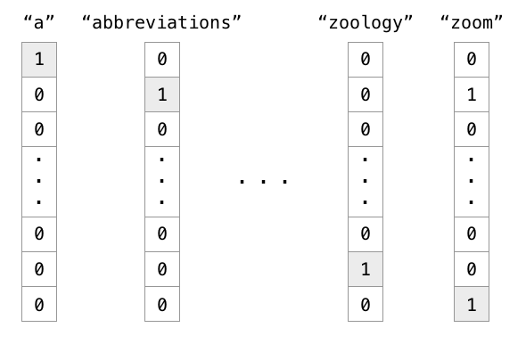
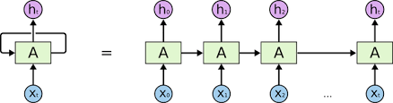
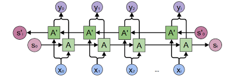

# SentiMent Analysis

In this project I built a model to classify movie reviews fromn the IMDB dataset of 50K reviews.

### WordtoVec :

Neural networks only work with numeric(float) values ; so how do they work on sequence models ; initially the solution was to convert words to one-hot vectors this worked out to be fine but this didnt allow the model to generalize at all. Example a model which could predict I want some orange _______ . Tha answer here is juiceand the model could do so because it was in its vocab but the model fails when the sentenc has apple and apple is not in its vocab.

The above image shows one-hot representations of words in the vocabulary.

#### So how do we solve this problem ?

Enter word representations . Where each word is represented by some m dimensional vector (not as big as the vocabulary). So we learn embeddings for words in the training set . This was one by the computationally expensive skip-gram model and its upgraded forms in the past now we have Transformers(BERT) . Wordtovec is still relevant today . 

The figure above shows vector representations of word embeddings and also their representations in vector space .

In this model I have used both pre-Trained word embeddings and ones which I have trained from scratch . Many NLP libraries provide pre - trained embeddings for eg Spacy , FastText etc . 
I have used Fasttext embeddings in the LSTM model . 

## Architectures used :

#### RNN Architecture 

The first model I built was using RNN architecture and trained embedding matrix from scratch . RNN model takes sequence as input along with activations of last layer as input and each block hastwo outputs the activations and ycap the prediction.

#### LSTM Network (Long Short Term Memory Network) :

The second model for the purpose of classification was a **BiLSTM(Bidirectional LSTM Model)** model which solves the problem of vanishing gradients commonly seen in RNNs(also known as forgetting information) . Here pre-trained word embeddings were used.  

Note: The parameters for each block are the same . We use the same block for all words in RNN an drelated architectures.

## References 

[Pytorch Documentation](https://pytorch.org/docs/stable/index.html)

[Wordtovec Paper](https://arxiv.org/abs/1310.4546)

[Colah's Blog on LSTMs](https://colah.github.io/posts/2015-08-Understanding-LSTMs/)

